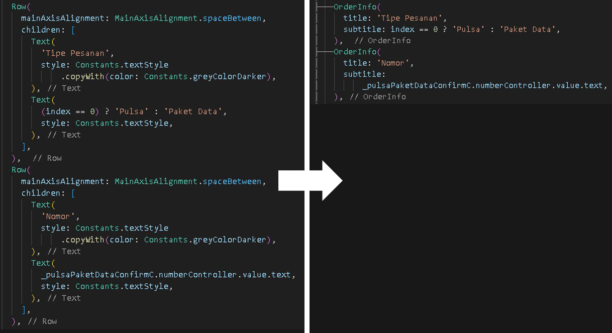

 # (Update) Refactoring Proposal
##
## + optimasi kode per module
##

Pengurangan repetisi kode 40-80% dengan pertegas modularisasi dan penerapan _feature-first_.


- Extract kode yang berulang menjadi _reusable widget_ lokal.
Contoh:



- Pemindahan semua logic yang ada di _views_ ke _controllers_.
Contoh:


- Pemindahan semua list yang ada di _views_ ke _services_.
Contoh:


- Up widget lokal yang juga digunakan di beberapa halaman lain ke level global (_mitraigr/core/widgets_).
Contoh:


- Menampung nama variable yang terlalu panjang agar lebih mudah dibaca.
Contoh:
   

##
## + restrukturisasi
##

Peningkatan skalabilitas dengan pembagian mitraigr menjadi _core_ dan _modules_.


- Folder _core_ berisi alat bantu seperti _helpers_ dan _widgets_ (level global).


- Folder _modules_ hanya berisi folder halaman.


- Isi folder _layanan_ dibagi berdasarkan section di halaman utama mitra
  ```example :```
  ```mitraPPOB -> hargaJual, promoMitra, rekapTransaksi, transaksiFavorit```


- Perubahan nama module menjadi sesuai dengan tampilan aplikasi. Contoh:
1. pricelist -> hargaJual  
2. promo -> promoMitra  
3. ringkasan -> rekapTransaksi  
4. transaksi -> transaksiFavorit     


- Perubahan nama file menjadi sesuai dengan nama halaman.
  ```example :```
  ```file pulsaDataScreen.dart -> nama halaman PulsaDataScreen```
Contoh:


- Menerapkan hierarki halaman di setiap module.

Di dalam folder _views_ setiap module, halaman utama module selalu ada di paling atas.    
  ```example :``` 
  ```halaman utama module promoMitra = promoMitraScreen.dart```

  ```example :```
  ```halaman detail (setelah halaman utama diklik) = promoMitraScreenDetail.dart```
Contoh:


##
## + sedikit perubahan nama
##

Bertujuan mengurangi kemungkinan konflik dependensi dan mengenali halaman tanpa perlu mengecek path.


- Nama halaman di _views_ selalu diakhiri 'Screen' (suffix).
  ```example :```
  ```halaman utama Pln sebelumnya PlnService menjadi PlnScreen```
Contoh:


- Nama class di _services_ selalu diakhiri 'Service' (suffix).

- Nama class di _controllers_ selalu diakhiri 'Controller' (suffix).


- Nama halaman module utama (folder main) diakhiri dengan 'MainPage'.
  ```example :```
  ```nama halaman utama mitra = MitraMainPage```
Contoh:


- Menghindari penamaan class yang sama dengan yang sudah ada di module lain.
